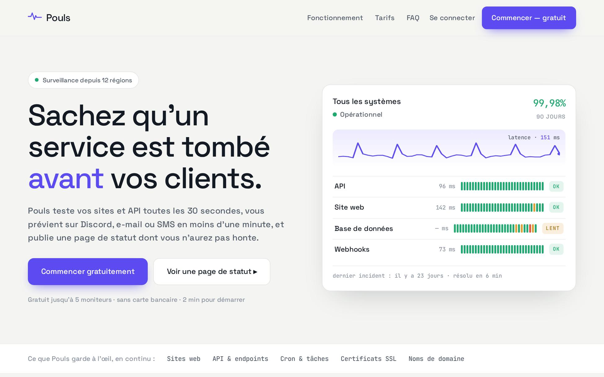

<div align="center">

# 📈 Pouls

### Landing produit d'un outil de surveillance & page de statut — **zéro dépendance.**


[](https://matgordfr.github.io/site-produit/)

<br>

[](https://matgordfr.github.io/site-produit/)

</div>

> [!NOTE]
> **Projet démo.** Le produit, les prix et les données sont **fictifs** — c'est une vitrine de savoir-faire front-end. Aucun paiement n'est traité, tout tourne dans le navigateur.

---

## ✨ Ce que ça montre

Une **landing produit / SaaS** complète, avec ce qui fait vraiment convertir :

- **Un board de statut vivant** — courbe de latence qui défile en temps réel, barres d'uptime sur 90 jours, pastilles OK / Lent / KO, taux d'uptime — la signature de la page.
- **Un titre animé** — révélation du titre mot à mot au chargement + soulignement du mot-clé.
- **« Comment ça marche »** — les 3 étapes (connecter → surveiller → alerter), en une lecture.
- **Un exemple de page de statut** — l'output réel du produit : composants, statuts et historique d'incidents.
- **Des intégrations** — les canaux d'alerte (Discord, Slack, e-mail, SMS, webhooks) et ce qui est surveillé.
- **Des avis** — témoignages de démonstration (personnages fictifs, annoncés comme tels).
- **Un pricing qui bascule** — mensuel ↔ annuel, les montants et le badge « −2 mois » se mettent à jour au clic.
- **Une FAQ dépliable** — en `<details>` natif (accessible, sans JS superflu).
- **Un bloc terminal** — mise en place « en une ligne », coloration syntaxique en JetBrains Mono.

## 🎨 Le craft

- **Identité produit** — papier froid + indigo de marque ; le vert/ambre/rouge est réservé à la **sémantique de statut**.
- **Polices auto-hébergées** — Space Grotesk (display & UI) + JetBrains Mono (métriques & code).
- **Graphismes dessinés à la main** — icônes de features et courbe de latence en SVG.
- **Accessible & responsive** — navigation clavier, focus visible, `prefers-reduced-motion` respecté, du grand écran au mobile.

## 🛠️ Stack


Aucun framework, aucune librairie, aucun CDN. ~100 Ko, polices comprises.

## 📁 Structure

```
index.html             → la page
assets/css/statut.css  → design system + board + sections (étapes, statut, intégrations, avis) + pricing + FAQ
assets/js/statut.js    → titre animé + pulse de latence + barres uptime + bascule tarifs
assets/fonts/          → Space Grotesk + JetBrains Mono (auto-hébergées)
```

## 🚀 Lancer en local

```bash
python3 -m http.server 8000
# puis http://localhost:8000
```

## 👤 Auteur

Réalisé par **[MatgordFR](https://github.com/MatgordFR)** — dev indépendant (bots Discord, sites, IA).
🌐 [matgord.com](https://matgord.com) · 🐦 [@matgordfr](https://x.com/matgordfr) · 🎨 [les autres démos](https://matgordfr.github.io/mes-demos-web/)

## 📄 Licence

[ISC](LICENSE) — libre d'usage.
